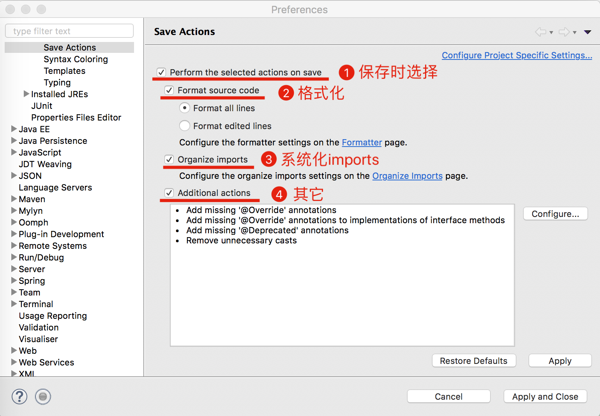
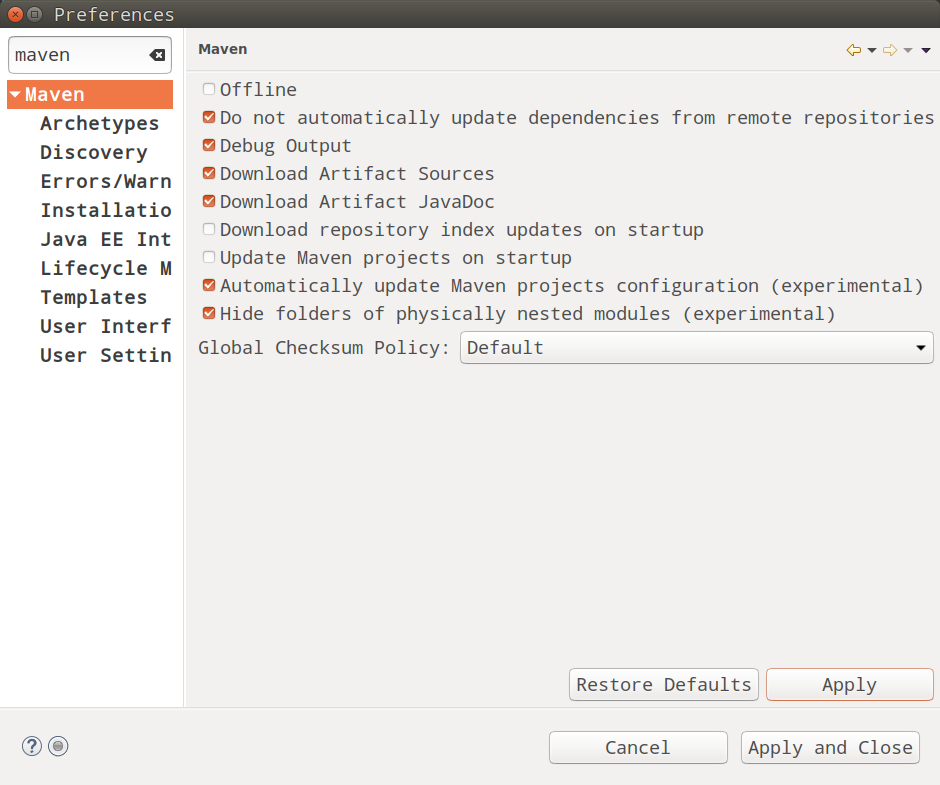

# eclipse配置

[TOC]

## 1. Preferences配置

### 1.1. 配置utf-8

### 1.2. 配置养眼的背景

1. 偏好设置->Preferences->General->Editor->Text Editors
2. 右边是Text Editors的面板，在下面Appearance color options选项中选Background color 选择背景颜色，去掉默认勾选的System default
3. 点击Color来调整背景色：调整RGB为199，237，204

### 1.3. 配置字体

修改Project Explorer的字体大小

- MAC

(似乎并不起作用)

 在 ```Contents/MacOS/eclipse.ini``` 下把 ```-Dorg.eclipse.swt.internal.carbon.smallFonts``` 全部删除

 在 ```应用程序``` 中找到eclipse，选择 ```显示包内容``` ， 然后到 ```Contents/Eclipse/plugins/org.eclipse.ui.themes_1.2.1.v20170809-1435/css``` 目录下找到 ```e4_default_mac.css``` 文件，将下面的内容添加进去

```css
#org-eclipse-jdt-ui-PackageExplorer Tree,
#org-eclipse-ui-navigator-ProjectExplorer Tree,
#org-eclipse-ui-views-ContentOutline Tree,
#PerspectiveSwitcher ToolBar {
    font-size: 15px; 
    background-color: rgb(204,238,205); 
}
```

### 1.4. 未捕获的异常直接抛出

 ```Java``` > ```Debug``` > 取消勾选 ```Suspend execution on uncaught exceptions```

### 1.5. java格式化代码

 ```Java``` > ```Code Style``` > ```formatter``` > ```Edit...```

- Tab用Space替换
 在 ```Indentation``` > ```Tab policy``` > 勾选 ```Spaces only```
- 垂直对齐
 在 ```Indentation``` > 勾选 ```Indentation``` 选项卡中的 ```Align fields in columns``` / ```Blank lines separating independent groups```
- 注释不改变原本的格式
 在 ```Comments``` > 取消勾选 ```Formater line comments on first column```
 在 ```Comments``` > 勾选 ```Never join lines```
- 写在语句后面的注释 ```//``` 对齐
 在 ```Comments``` > 勾选 ```Preserve white space between code and line comments```

### 1.6. 保存时自动系统化imports以及格式化代码

菜单 ```Preferences``` > ```Java``` > ```Editor``` > ```Save Actions```

配置如下图：



### 1.7. HTML延长换行宽度

在 ```web``` > ```HTML Files``` > ```Editor``` > Line width > 180

### 1.8. 配置Maven

- maven通用配置



- 默认打开pom.xml文件时打开XML页面

 在 ```Maven``` > ```User Interface``` > 勾选 ```Open XML page in the POM editor by default```

- Installations

### 1.9. 配置GIT

- Configuration

Location: /home/zbz/.gitconfig

```ini
[user]
    name = zbz
    email = nnzbz@qq.com
[core]
    autocrlf = input
```

### 1.10. 关闭校验

- 关闭Validation

 在 ```Validation``` > 取消勾选 ```Suspend all validators```

- 关闭拼写

 在 ```General``` > ```Editors``` > ```Text Editors``` > ```Spelling``` > 取消勾选 ```Enable spell checking```

### 1.11. 去掉多余的启动项

 在 ```Genaral``` > ```Startup and Shutdown```

### 1.12. 打开过多自动关闭前面的页面

 在 ```General``` > ```Editors``` > 勾选 ```Close editors automatically```

## 2. 创建桌面快捷方式（Ubuntu）

```sh
vi ~/Desktop/eclipse.desktop
```

```ini
[Desktop Entry]
Encoding=UTF-8
Name=Eclipse
Comment=Eclipse
Exec=/usr/local/eclipse/eclipse-oxygen/eclipse
Icon=/usr/local/eclipse/eclipse-oxygen/icon.xpm
Terminal=fasle
StartupNotify=true
Type=Application
Categories=Application;Development;
```

```sh
sudo chmod u+x ~/Desktop/eclipse.desktop
```

## 3. 安装插件

### 3.1. 反编译(Enhanced Class Decompiler)

### 3.2. STS(Spring Tools)

**注意:**
安装STSv3.9.0之后， 与Organize Imports冲突，导致ctrl+shift+o热键失效
解决方案：

> 1、 ```Preferences``` > ```General``` > ```Keys``` > ```Filters...``` > 取消选择 ```Filter uncategorized commands``` > ```OK```
> 2、 ```Keys``` > ```"Go To Symbol in File"``` > ```Unbind Command``` > ```Apply and Close```

### 3.3. Docker工具(Eclipse Docker Tooling)

管理docker的镜像及容器

或docker editor 1.0.0

### 3.4. YEdit

YAML文件编辑插件

## 4. 配置Tomcat
